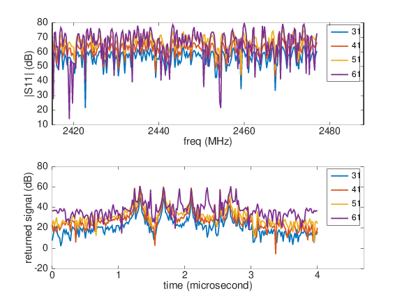
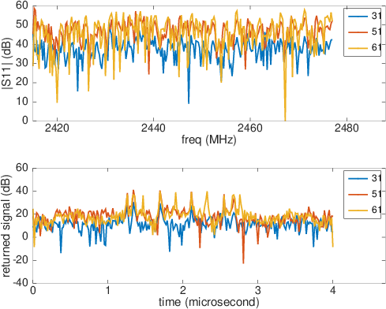

# RSSI_Hybrid_Reader

Embedded software for controlling the RSSI Gmbh Hybrid Reader

Tested on a Raspberry Pi2 on the RSSI evaluation board powered (+5V from
a regulated power supply) through J5 with R13 and R14 (22 ohms) for connecting
the serial communication line.

Raspberry Pi2 firmware compiled from https://github.com/buildroot/buildroot using the
``make raspberrypi2_defconfig`` recipe, possibly adding ``screen`` for real time communication
with the reader connected to ``/dev/ttyAMA0``. Make sure to remove the console from the
serial port (set ``root=/dev/mmcblk0p2 rootwait 
console=tty1 ip=192.168.0.2::192.168.0.1:255.255.255.0:rpi:eth0:off`` from ``console.txt``
in the first partition of the SD card, removing any reference to ``/dev/ttyAMA0`` to free
the port for our own software).

Three programs are provided with increasing complexity to get familiar with communicating
between the RPi2 and the reader: ``rssi_sdm1.c`` for fetching the configuration (can also
be fetched using the ``vv`` command from ``screen`` launched using `` screen /dev/ttyAMA0 115200``),
then ``rssi_sdm2.c`` for basic configuration and fetching a sentence (high pass filtered
frequency response), and finally ``rssi_sdm.c`` the final software with options provided
from the command line. Assuming serial communication is available instead of ``read()``
and ``write()``, this software should be adapted to any microcontroller based communication.

# Configuration and processing

As all with all network analyzer measurements, there is a one to one relationship
between frequency and time domain characteristrics through the inverse Fourier transform.

It is worth remembering the X-axis of each domain when setting the configuration:
* typical delay lines will hardly exhibit responses beyond 4 microseconds, so that a frequency
step of 250 kHz is enough (1/250 kHz=1 us). The frequency step is defined by the total time-domain
response duration
* the bandwidth defined the time-resolution, or in other words the frequency step*number of
points defined the time resolution as total duration/number of points. A typical number of 250 
samples should be more than enough (5 microseconds/250 samples=20 ns time resolution).
* windowing the frequency reponse prior to inverse Fourier transform might be advisable, although
not done here.

All tests performed on SAW Components (Dresden, Germany) reflective delay lines connected throgh
attenuators or  Huber & Suhner 8 dBi 2.45 GHz circularly polarized antennas.

First attenuators for a reproducible setup: Friis equation tells us that a Free Space Propagation Loss
at 1 m at 2.45 GHz is 40 dB (80 dB two-way trip). The measurement with the reader default 40 unit output
power and 32 to 40 dB attenuator.

Wired configuration with various attenuators.

Wireless measurement at a range of 120 cm with the default averaging of 40 sweeps

Wireless measurement at a range of 300 cm with the default averaging of 40 sweeps and as
a function of emitted power.

